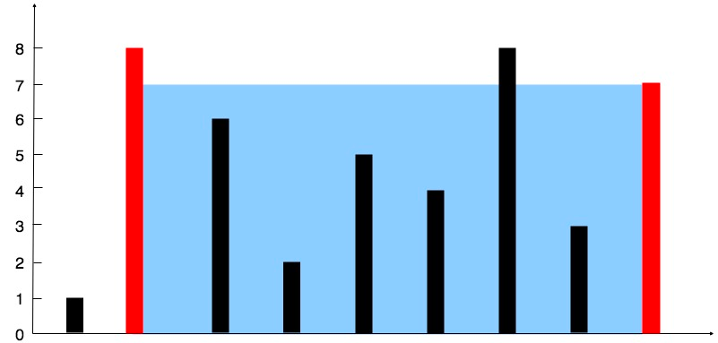
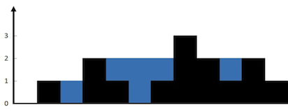

Array
     1)  Two Sums
         https://leetcode.com/problems/two-sum/
             Given an array of integers nums and an integer target, return indices of the two numbers such that they add up 
            to target. You may assume that each input would have exactly one solution, and you may not use the same element 
            twice. You can return the answer in any order.
  2)  Container With Most Water
         https://leetcode.com/problems/container-with-most-water/
          
             You are given an integer array height of length n. There are n vertical lines drawn such that the 
            two endpoints of the ith line are (i, 0) and (i, height[i]). Find two lines that together with 
            the x-axis form a container, such that the container contains the most water. Return the maximum amount of 
            water a container can store. Notice that you may not slant the container.
          
        Solution Tips: Two shifting pointers. We need to focus on the min(a,b). The optimization problem is to maximize min(a,b).
        So, increment the pointer of the value which is minimum in min(a,b)
  3) Trapping Rain Water
         https://leetcode.com/problems/trapping-rain-water/
          
             Given n non-negative integers representing an elevation map where the width of each bar is 1, compute 
            how much water it can trap after raining.
          
        Solution Tips: 
          1. Verify Constraints: 
                 Do the Left and Right side of graph count as walls?
                 Will there be negative integers?